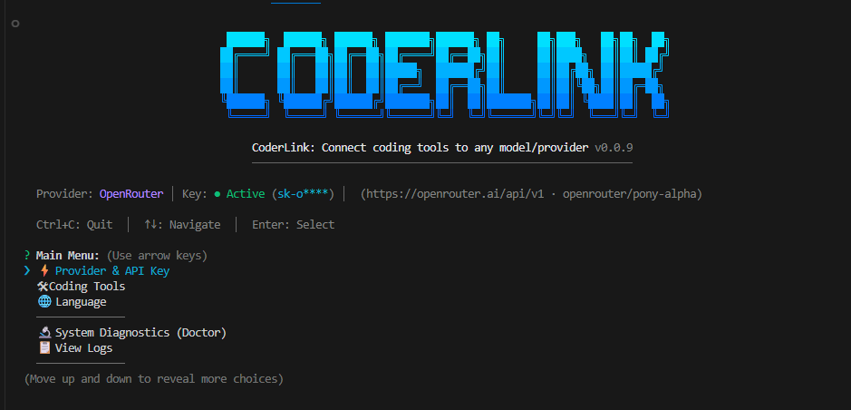
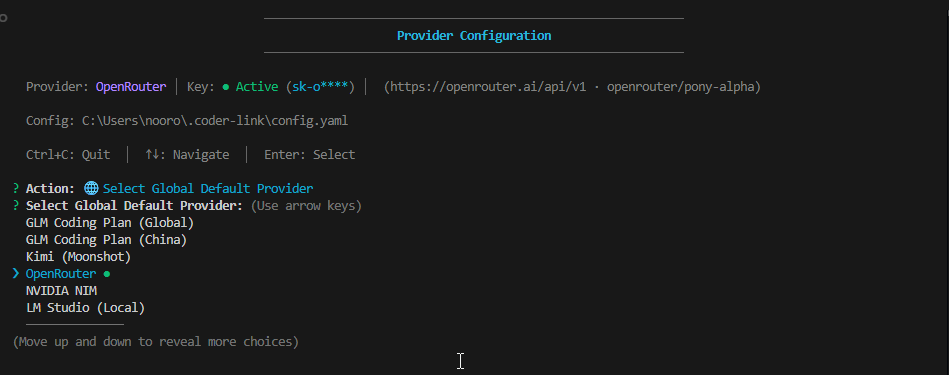
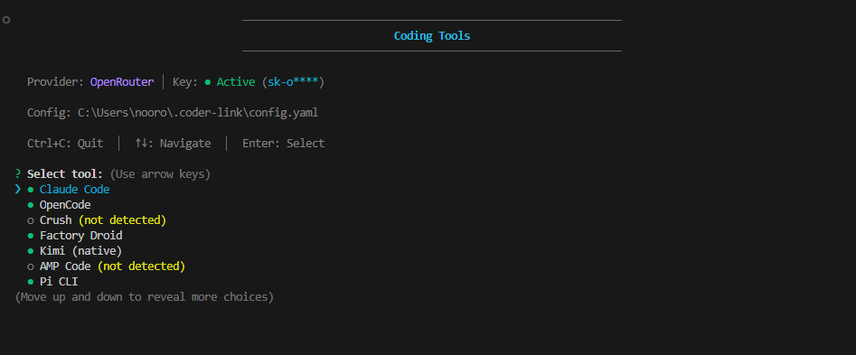

# Coder Link (coder-link)

A CLI that links coding tools to models from multiple providers.

## Features

- **Multi-Provider Support**: GLM Coding Plan (Global/China), Kimi 2.5, OpenRouter, NVIDIA, and LM Studio (local)
- **Interactive Wizard**: Friendly onboarding guidance on first launch
- **Tool Management**: Automatically configures CLI tools with your API credentials
- **MCP Configuration**: Easily manage Model Context Protocol services
- **Local Storage**: All settings stored securely on your machine
- **Internationalization**: Chinese and English bilingual interface
- **Status & Health Check**: View current configuration and diagnose issues quickly

## Screenshots

### Main Menu


### Provider Configuration


### Coding Tools


## Supported Coding Tools

- Claude Code
- OpenCode
- Crush
- Factory Droid
- Kimi (native)
- AMP Code
- Pi CLI

## Quick Start

**Prerequisite**: Node.js 18 or later

### Install and Launch

#### Option 1: Run directly with npx

```bash
npx coder-link
```

#### Option 2: Install globally with npm

```bash
npm install -g coder-link
coder-link
```

#### Option 3: Install globally with bun

```bash
bun add -g coder-link
coder-link
```

### Complete the Wizard

Once you enter the wizard UI, use Up/Down arrow keys to navigate and press Enter to confirm each action, following the guided initialization flow.

The wizard will help you complete:

1. **Select UI language** (English or Chinese)
2. **Choose a provider** (GLM Coding Plan Global/China, Kimi 2.5, OpenRouter, or NVIDIA)
3. **Enter your API key**
4. **Select tools to manage**
5. **Automatically configure selected tools**
6. **Manage MCP services** (optional)

## Command List

### Show help
```bash
coder-link -h
coder-link --help
```

### Show version
```bash
coder-link -v
coder-link --version
```

### Run the initialization wizard
```bash
coder-link init
```

### Language management
```bash
coder-link lang show              # Display the current language
coder-link lang set zh_CN         # Switch to Chinese
coder-link lang set en_US         # Switch to English
coder-link lang --help            # Show help for language commands
```

### API key management
```bash
coder-link auth                              # Interactively set key
coder-link auth glm_coding_plan_global <token>   # Choose Global plan and set key
coder-link auth glm_coding_plan_china <token>   # Choose China plan and set key
coder-link auth kimi <token>                    # Set Kimi API key
coder-link auth openrouter <token>              # Set OpenRouter API key
coder-link auth nvidia <token>                 # Set NVIDIA API key
coder-link auth revoke                       # Delete the saved key
coder-link auth reload <tool>                # Reload config into a tool
coder-link auth --help                        # Show help for auth commands
```

### Tool management
```bash
coder-link tools list             # List all supported tools and their status
coder-link tools install <tool>   # Install a coding tool
coder-link tools uninstall <tool> # Uninstall a coding tool
```

### MCP management
```bash
coder-link mcp list               # List available MCP services
coder-link mcp installed          # List installed MCP services
coder-link mcp install <service>  # Install an MCP service
coder-link mcp uninstall <service> # Uninstall an MCP service
```

### Health check
```bash
coder-link doctor                 # Inspect system configuration and tool status
```

## Configuration File

The configuration file is stored at `~/.coder-link/config.yaml`:

```yaml
lang: zh_CN                    # UI language
plan: glm_coding_plan_global   # Plan type: glm_coding_plan_global, glm_coding_plan_china, or kimi
api_key: your-api-key-here     # API key
```

## Provider Details

### GLM Coding Plan (Global)
- **Base URL**: `https://api.z.ai/api/anthropic` (Claude Code) or `https://api.z.ai/api/coding/paas/v4` (others)
- **Models**: GLM-4.7, GLM-4.6, GLM-4.5-air
- Get your API key from [Z.AI Open Platform](https://z.ai/model-api)

### GLM Coding Plan (China)
- **Base URL**: `https://open.bigmodel.cn/api/anthropic` (Claude Code) or `https://open.bigmodel.cn/api/coding/paas/v4` (others)
- **Models**: GLM-4.7, GLM-4.6, GLM-4.5-air
- Get your API key from [Z.AI Open Platform](https://z.ai/model-api)

### OpenRouter
- **Base URL**: `https://openrouter.ai/api/v1`
- **Models**: Various LLMs including Claude, GPT, and more
- Get your API key from [OpenRouter.ai](https://openrouter.ai/keys)

### NVIDIA
- **Base URL**: Via NVIDIA's API gateway
- **Models**: Various NVIDIA-hosted models
- Sign up for access at [NVIDIA's developer portal](https://developer.nvidia.com/)

## How It Works

The tool uses a manager pattern where each coding tool has its own manager class that knows how to:

1. Read and write the tool's configuration file
2. Inject the appropriate API credentials and endpoints
3. Detect existing configurations
4. Manage MCP (Model Context Protocol) services

When you run `coder-link auth <plan> <token>` or use the wizard, the tool:

1. Saves your API key and plan type to `~/.coder-link/config.yaml`
2. For each selected tool, calls its manager's `loadConfig()` method
3. The manager writes the appropriate configuration to the tool's config file
4. MCP services can be installed to extend tool capabilities

## MCP Services

MCP (Model Context Protocol) allows coding tools to access external services. Built-in MCP services include:

- **filesystem**: File system operations
- **github**: GitHub integration

You can also install custom MCP services through the tool's own marketplace (Claude Code) or manually configure them.

## Development

```bash
# Clone the repository
git clone https://github.com/HenkDz/coder-link.git
cd coder-link

# Install dependencies
bun install

# Build
bun run build

# Run in development mode
bun run dev

# Lint
bun run lint
```

## Contributing

We welcome contributions! Please feel free to submit issues or pull requests.

## License

MIT
